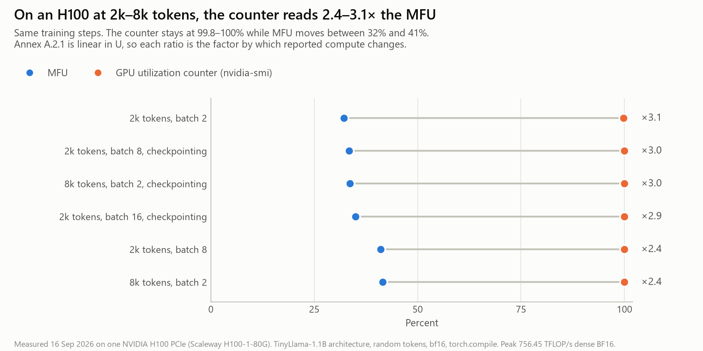
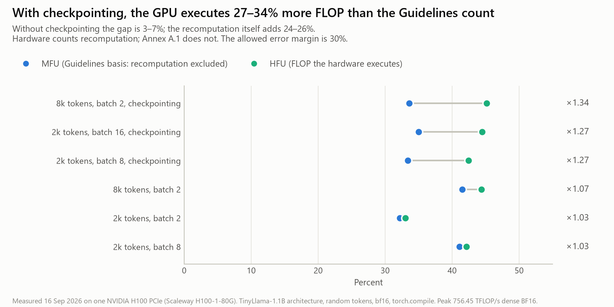

# H100 probe: every reading of "GPU utilisation" on one H100

**Measured 16 September 2026** on one NVIDIA H100 PCIe (Scaleway H100-1-80G, driver 580.126.20, PyTorch 2.6.0).
**Reproduce:** `python analysis/h100_probe_analysis.py`. It writes the figures, `h100_probe_summary.csv` and `h100_probe_summary.json` to `analysis/out/`.
**Raw data:** `probe/results/20260916T190612Z/`.

This run removes the main caveat of the public-data re-analysis (`REANALYSIS.md`): the 11-token sequences.

---

## Setup

| | |
|---|---|
| Model | TinyLlama 1.1B architecture: 22 layers, d 2048, 32 query / 4 key-value heads, SwiGLU 5632. It's the model behind Model A in the Commission's June 2025 draft |
| Data | Random tokens. The FLOPs of a step don't depend on token values |
| Precision and compilation | bf16 autocast, `torch.compile`, native grouped-query attention |
| Configurations | Sequence length 2k or 8k tokens; batch size 2, 8 or 16; full activation checkpointing on or off. Six configurations in total |
| Timing | 45 s warm-up, then 120 s measured per configuration. About 1,200 NVML samples and 1,200 DCGM samples each |
| Readings, all taken on the same steps | NVML utilisation counter, DCGM SM activity, DCGM tensor-pipe activity, OFU, HFU (executed FLOPs, from PyTorch's FLOP counter), MFU (model FLOPs on the Annex A.1 basis), power, energy |

## Results

| Configuration | tok/s | MFU | HFU | OFU | Tensor activity | SM activity | Counter | Counter ÷ MFU |
|---|---:|---:|---:|---:|---:|---:|---:|---:|
| 2k tokens, batch 8 | 42,489 | 41.1% | 42.1% | 43.5% | 57.9% | 93.9% | 100% | **2.43×** |
| 2k, batch 8, checkpointing | 34,533 | 33.4% | 42.4% | 43.7% | 59.5% | 94.0% | 100% | **2.99×** |
| 2k, batch 2 | 33,288 | 32.2% | 33.0% | 35.0% | 42.3% | 85.7% | 99.8% | **3.10×** |
| 8k tokens, batch 2 | 29,507 | 41.5% | 44.4% | 43.4% | 52.4% | 94.9% | 100% | **2.41×** |
| 8k, batch 2, checkpointing | 23,910 | 33.6% | 45.1% | 44.2% | 53.4% | 94.9% | 100% | **2.97×** |
| 2k, batch 16, checkpointing | 36,196 | 35.0% | 44.5% | 44.5% | 63.2% | 95.7% | 100% | **2.86×** |

On a single run the readings step down: **counter 100% → SM activity 94% → tensor activity 58% → OFU 44% → HFU 42% → MFU 41%**. Only the last of these is on the Guidelines' basis.

---

## Findings

### H1. At realistic sequence lengths, the counter reads 2.4–3.1× the MFU

This replicates the public-data result (R1 in `REANALYSIS.md`) under production-like conditions: 2k–8k tokens, a compiled model, and MFU of 32–42%.

**The counter carries no information.** It reads 100% in every configuration while MFU ranges from 32% to 42%. A regulator reading the counter can't tell an efficient run from an inefficient one.

### H2. Hardware-side measurements count the recomputation the Guidelines exclude

With full activation checkpointing:
- the GPU executes **27% more FLOPs per token at 2k tokens and 34% more at 8k**
- throughput drops 19% (42,489 to 34,533 tokens/s)
- **MFU falls from 41% to 33%, while HFU and OFU stay at 42–44%**

Annex A.1 excludes "recomputation of activations to save memory". Every hardware-side instrument, whether the FLOP counter, DCGM or OFU, sees the executed operations, recomputation included. **A hardware-based estimate therefore overstates Guidelines-basis compute by 27–34% whenever checkpointing is used: roughly the entire 30% margin, from one undisclosed setting.**

### H3. OFU tracks HFU, not MFU

OFU comes out at 35–45%, **within −2% to +6% of HFU** in every configuration. This confirms Pedersen et al.'s instrument on a second card type, and also its limit: it's a very good measure of *executed* FLOPs, but it can't recover the model-FLOP basis without knowing the checkpointing policy.

OFU here uses the PCIe tensor-core clock of 1,620 MHz where Pedersen et al. use 1,830 MHz for the SXM.

### H4. Even "MFU" isn't one number

Whether the attention term is halved for causal masking changes MFU by **8% at 2k tokens and 26% at 8k**. Both conventions appear in widely used codebases. At long context, the convention alone is close to the whole margin.

### H5. Utilisation doesn't transfer between GPUs, even for the same architecture

TinyLlama's reported 56% MFU was measured on an A100. The same architecture measured **41% here**. The Commission's draft carried that 56% over to other models; carrying it to this GPU would overstate compute by **1.36×**.

### H6. Energy: the card ran power-capped, and energy per FLOP depends on configuration

| Configuration | Power | Clock ÷ max | J per model FLOP |
|---|---:|---:|---:|
| 2k tokens, batch 8 | 346 W | 0.69 | 1.11 × 10⁻¹² |
| 2k, batch 8, checkpointing | 346 W | 0.68 | 1.37 × 10⁻¹² |
| 2k, batch 2 | 343 W | 0.76 | 1.41 × 10⁻¹² |
| 8k tokens, batch 2 | 345 W | 0.76 | 1.10 × 10⁻¹² |
| 8k, batch 2, checkpointing | 345 W | 0.76 | 1.36 × 10⁻¹² |
| 2k, batch 16, checkpointing | 347 W | 0.65 | 1.31 × 10⁻¹² |

- **The GPU sat at its 350 W software power cap throughout.** `nvidia-smi -q -d PERFORMANCE` under load shows `SW Power Cap: Active`, with all thermal and hardware slowdown counters at zero (`nvidia_smi_performance_under_load.txt`). The clock ran at 65–76% of its 1,755 MHz maximum.
- **The power limit is itself a setting:** 350 W was configured, against a 310 W default. Nothing in the Model Documentation Form captures it, yet it changes how much work a GPU does per hour.
- **Energy per model FLOP varies 1.28× (±12%) across configurations on identical hardware.** Checkpointing alone raises it by 23%, because energy follows executed FLOPs, not model FLOPs.
- **The linear relationship between MFU and power** (Enskat & Wiesner) **doesn't hold under a power cap**: power stayed flat while MFU moved from 32% to 42%.

**What this means for Finding 5.** The Form's energy figure is still the national regulator's most precise quantitative handle, but even on known hardware it constrains compute only to about ±12%. It also inherits the recomputation bias from H2 and the energy-boundary question (GPU, node or facility).

### H7. The peak figure for "an H100" isn't unique, even in NVIDIA's own documents

| Source | H100 PCIe | H100 SXM |
|---|---:|---:|
| Clock-derived: streaming multiprocessors × 4,096 FLOPs/cycle × tensor-core clock | **756.45** (114 × 4,096 × 1,620 MHz) | **989.4** (132 × 4,096 × 1,830 MHz), the Commission's Model H figure |
| NVIDIA H100 Tensor Core GPU Architecture whitepaper V1.01 (rounded) | 800 | 1,000 |

All figures are TFLOP/s, dense BF16. The **Form's example entry, "Nvidia H100 days", doesn't say which variant was used**, and the two variants' peaks differ by **1.31×**.

How much this moves the result on this run:

| Peak assumed for this GPU | Baseline MFU | Counter ÷ MFU |
|---|---:|---:|
| 756.45 (PCIe, clock-derived), **used here** | 41.1% | 2.41–3.10× |
| 800 (PCIe, whitepaper) | 38.8% | 2.55–3.28× |
| 989.4 (SXM, datasheet) | 31.4% | 3.15–4.06× |
| 1,000 (SXM5, whitepaper) | 31.1% | 3.19–4.10× |

The more a provider's documents understate which card they used, the larger the gap between the counter and MFU becomes. **H1 is therefore conservative.**

---

## Caveats: state these in the paper

1. **One GPU and a 1.1B-parameter model.** No multi-node communication, no pipeline or tensor parallelism, no MoE. Those add inefficiencies that widen, not narrow, the gap between hardware readings and MFU.
2. **An H100 PCIe under a 350 W power cap**, not an SXM at 700 W. MFU on an SXM would be higher; the counter would still read 100%.
3. **The 1,620 MHz tensor-core clock** comes from NVIDIA's developer forum, and **756.45** is derived from it. Both are consistent with the whitepaper's streaming-multiprocessor count, and with the SXM derivation Pedersen et al. confirm. H1's sensitivity to this choice is shown in the table above.
4. **Random tokens and a 45 s warm-up plus 120 s measurement.** That's adequate for steady-state throughput, but it doesn't cover checkpoint writes, failures or restarts.
5. **The argument this supports is a lower bound on a regulator's uncertainty**, not the true compute of any frontier model.

## What this adds to the paper

- **Finding 1** now rests on a controlled H100 measurement, not only on public 11-token data.
- **Finding 6** (executed vs required FLOPs) is **directly measured**: +27–34% under checkpointing.
- **Finding 2** gains a clean example: one GPU name, two variants, and four published peaks (756.45 / 800 / 989.4 / 1,000).
- **Finding 5** is refined: under power caps, energy constrains compute only to about ±12%, and it follows executed FLOPs.
- **The Article 53(5) schema is confirmed**: the checkpointing policy, the exact accelerator variant (PCIe or SXM) and the power limit all change the answer, and none of them is in the Form.

## Files

| File | Contents |
|---|---|
| `out/fig4_h100_counter_vs_mfu.{png,pdf}` | Counter vs MFU, per configuration |
| `out/fig5_h100_recomputation.{png,pdf}` | MFU vs HFU: the recomputation gap |
| `out/h100_probe_summary.csv` | Every reading per configuration (the data behind both figures) |
| `out/h100_probe_summary.json` | Headline numbers and the peak-sensitivity table |
| `../probe/results/20260916T190612Z/` | Raw results, NVML and DCGM samples, environment, `nvidia-smi` performance capture |
