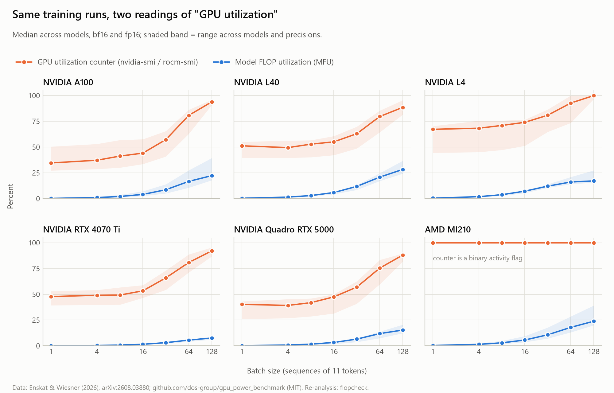
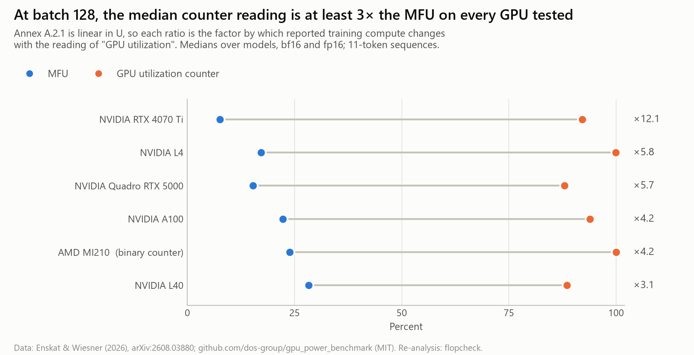
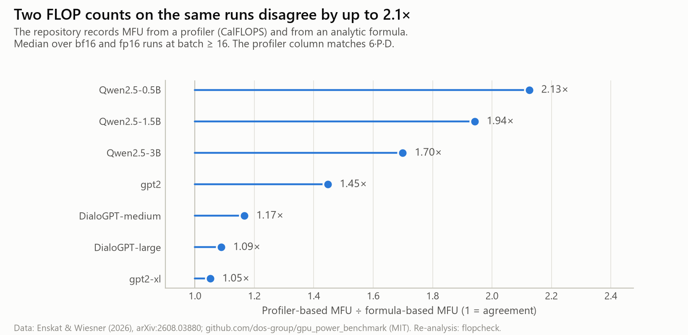

# Re-analysis: what "GPU utilisation" means on the same training runs

**10 September 2026.** An independent re-analysis of a public dataset through Annex A.2.1 of the Commission's GPAI Guidelines. It replaces the week-3 GPU rental in the roadmap.

**Reproduce:** `python analysis/reanalysis_dos_group.py`. It writes figures (PNG and PDF), a CSV of the data behind each figure, and `summary.json` to `analysis/out/`.

---

## Source

- **Paper:** Enskat & Wiesner (2026), *Evaluating MFU as a Proxy for GPU Power for Energy-Aware Simulation of LLM Training*, arXiv:2608.03880.
- **Data:** `github.com/dos-group/gpu_power_benchmark`, MIT licence, © Enskat, Wiesner & Kao. The six per-configuration aggregate CSVs are used unchanged. The commit is recorded in `data/dos-group-gpu-power-benchmark/SOURCE_COMMIT.txt`.
- **What was measured:** single-GPU training steps (forward, backward, AdamW) on NVIDIA A100, L40, L4, RTX 4070 Ti, Quadro RTX 5000 and AMD MI210. Seven models from 124M to 3.1B parameters, batch sizes 1–128. For every configuration the data records throughput, **MFU**, the vendor's **GPU-utilisation counter** (`nvidia-smi` / `rocm-smi`) and board power, all sampled on the same run.

## The question

Annex A.2.1 multiplies four numbers, one of them "the average percentage of GPU utilisation", which it never defines. Two quantities a provider could report in good faith are the vendor's utilisation counter and MFU. **Because the formula is linear in U, the ratio between them is exactly the factor by which the reported training compute changes.**

## Which rows were used, and why

| Filter | Reason |
|---|---|
| Idle "baseline" row dropped | Not a training run |
| The paper's protocol only (5 warm-up steps, 5 s cool-down) | Same measurement conditions as the published analysis |
| **bf16 and fp16 only** | For "fp32" the repository divides by a different peak on each device, and on two devices the result is physically impossible (see R4) |
| MFU = the profiler-based (CalFLOPS) column | The one the paper uses. **It matches 6·P·D to within 1% for all seven models** (0.998–1.009) |

That leaves **462 configuration rows**: six GPUs × three models each × two precisions × seven batch sizes × two "context window" settings (the Quadro RTX 5000 has fp16 only). The two context settings are effectively replicates, because the input is 11 tokens either way (caveat 1).

---

## Results

### R1. On the same runs, the utilisation counter reads 3–12× the MFU

Medians over models and precisions at batch 128:

| GPU | MFU | Utilisation counter | Ratio |
|---|---:|---:|---:|
| NVIDIA L40 | 28% | 89% | **3.1×** |
| NVIDIA A100 | 22% | 94% | **4.2×** |
| AMD MI210 | 24% | 100% (a yes/no flag) | **4.2×** |
| NVIDIA Quadro RTX 5000 | 15% | 88% | **5.7×** |
| NVIDIA L4 | 17% | 100% | **5.8×** |
| NVIDIA RTX 4070 Ti | 8% | 92% | **12.1×** |

Across individual runs at batch 128 on NVIDIA hardware, the ratio ranges from **2.3× to 14.4×**.

**What this means for Annex A.2.1:** a provider who reads "GPU utilisation" as the counter their cluster dashboard already shows would report **three to twelve times** the training compute of one who reads it as MFU, for the same run, with the same hardware and the same honest arithmetic. The Guidelines allow 30%.

**There's no fixed conversion factor between the two.** At batch 1 the counter already reads 35–67% while MFU is below 1%; the counter then saturates while MFU keeps climbing (Figure 1). How far apart they are depends on the workload, so a regulator can't correct one into the other after the fact.

### R2. On AMD hardware the counter doesn't measure utilisation at all

The MI210's counter reads **at least 99.8% on every training run**, at every batch size. The paper explains that ROCm reports a yes/no activity flag. So the word the Annex uses maps onto different quantities on different vendors, and on this one it's constant.

### R3. Two ways of counting FLOPs disagree by up to 2.1× on the same runs

The repository stores two MFU values per run: one from a profiler (CalFLOPS), and one from an analytic formula in its own code. The profiler matches 6·P·D. The formula gives **0.48–0.95 of it**, so the two MFUs differ by **1.05× to 2.13×** depending on the model.

**The cause, from the code** (`benchmark.py`, `calculate_analytical_mfu`):
- The formula labels the standard *training* term (6·P plus the attention term) as "forward" and then multiplies it by 3, which triples it.
- When a model's configuration doesn't expose a parameter count, it falls back to 4·L·d², which is about a third of a transformer block's real size.

The two errors roughly cancel for GPT-2-style blocks (gpt2-xl, the DialoGPT family: 1.05–1.17×). They don't cancel for Qwen2.5 (grouped-query attention, wider MLPs, large vocabulary: 1.70–2.13×).

**Why this matters beyond this repository:** it's the same failure the OFU paper found in production Megatron-LM (MoE and hybrid models over-counted by up to 3×). An architecture-based estimate is only as good as the FLOP formula behind it, and those formulas silently break on new architectures. Even the Annex A.2.2 route needs independent checking.

### R4. "FP32" means a different peak on each device, and two results are physically impossible

For fp32, the repository normalises by: the TF32 tensor peak on A100, the FP16 tensor peak on Quadro RTX 5000, the BF16 matrix peak on MI210, and the plain FP32 peak on L4. The resulting fp32 MFUs imply:

| GPU | Highest fp32 MFU | Implied throughput | Device's published FP32 peak | Implied ÷ peak |
|---|---:|---:|---|---:|
| AMD MI210 | 97.6% | 177 TFLOP/s | 45.3 matrix / 22.6 vector | **3.9×** |
| NVIDIA Quadro RTX 5000 | 59.0% | 52.6 TFLOP/s | 11.2 (tensor 89.2) | **4.7×** |

Peaks verified against the AMD MI210 brochure and the NVIDIA Quadro RTX 5000 datasheet. I haven't tried to diagnose the cause; those rows are simply excluded.

**This is Finding 2 happening in practice.** Careful researchers, who wrote down which peak they used, still produced utilisation figures above 100% of what the hardware can do, because "peak theoretical performance" has no agreed basis for a given number format. The Annex has exactly the same gap.

---

## Caveats: state these in the paper

1. **Every run uses an 11-token input sequence.** `sequence_length_mean` is 11 at both "context window" settings, even though the paper describes padding to 512 or 2,048 tokens. Steps are tiny: at most 1,408 tokens per step. Production pre-training runs at higher MFU.
2. **Single GPU, models of 3.1B parameters or fewer, no H100, no FP8, no multi-node.**
3. **So these ratios show that the two quantities differ and diverge systematically. They don't measure the size of the gap in a frontier run.** Take a healthy production MFU of 45% against a counter reading of 95%: the ratio is still **2.1×**, a +110% error against a 30% margin. The OFU paper's production fleet averaged about 25% MFU, which would put the ratio nearer 4×.
4. The argument the paper needs is a **lower bound on a regulator's uncertainty**, and this data supports it: one ambiguous word, measured on real hardware, moves the result by at least 2× even under generous assumptions.

**Optional confirmation (about €25):** one H100 run with realistic sequence lengths (2k–8k), recording the counter, MFU and DCGM tensor activity together. It would add the H100 and FP8, the hardware the Commission's Model H uses. It's no longer on the critical path.

## Crediting the source

Cite Enskat & Wiesner (2026) prominently: their measurement makes this section possible. R3 and R4 are observations about *their repository's secondary columns*. Their paper's main analysis uses the profiler-based MFU, which checks out. If you want, it would be good form to tell the authors about the formula and fp32-peak issues before the preprint goes out, as a courtesy. That's your call.

## Files

| File | Contents |
|---|---|
| `out/fig1_util_vs_mfu.{png,pdf}` + `fig1_by_batch.csv` | Counter vs MFU across batch size, per GPU |
| `out/fig2_gap_at_batch128.{png,pdf}` + `fig2_batch128.csv` | The gap at batch 128, with the ratio |
| `out/fig3_flop_count_methods.{png,pdf}` + `fig3_flop_methods.csv` | Profiler vs formula FLOP counts |
| `out/fp32_peak_report.csv` | Implied fp32 throughput vs device peaks |
| `out/summary.json` | Headline numbers |
